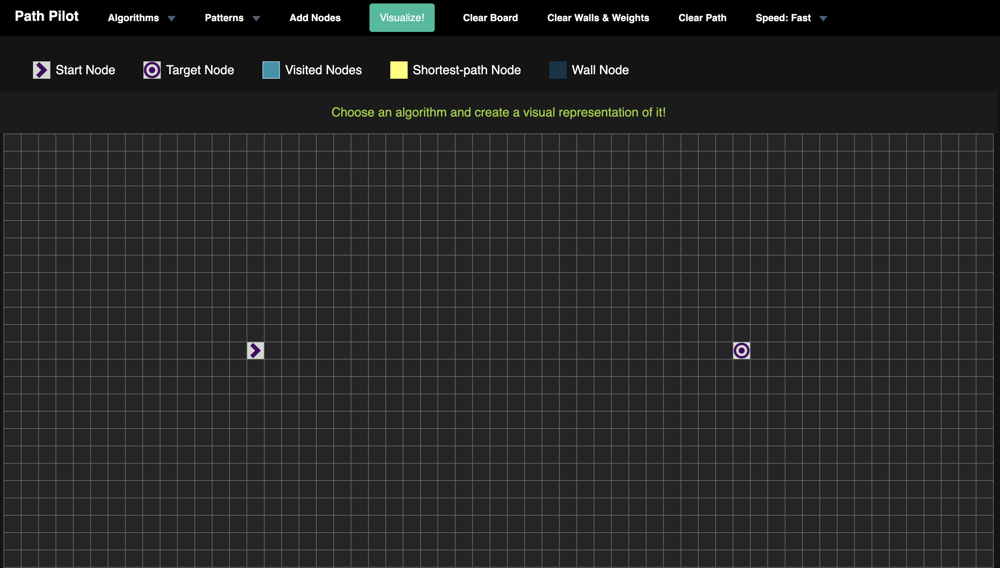

# "Path Pilot": Your Ultimate Pathfinding Algorithm Visualizer! 🛤️
### Are you eager to dive into the world of pathfinding algorithms and explore their intricate workings? Look no further than "Path Pilot" – an innovative and interactive visualizer that brings the magic of pathfinding algorithms to life.

# Tech Stack
* Node
* HTML
* CSS
* JavaScript
* Dijkstra's Algorithm
* A* Search
* Greedy Best-first Search
* Swarm Algorithm
* Convergent Swarm Algorithm
* Bidirectional Swarm Algorithm
* Breadth-first Search
* Depth-first Search

## Features:

* 🚀 Algorithm Showcase: "Path Pilot" showcases a range of powerful pathfinding algorithms, including Dijkstra's, A*, Bidirectional, BFS, and DFS. Witness these algorithms in action as they chart their way through mazes and obstacles.

* 🗺️ Interactive Grid: Seamlessly navigate through an interactive grid, where you can effortlessly add obstacles, establish start and target nodes, and experiment with different configurations.

* 🎥 Real-Time Visualization: Experience the thrill of real-time visualizations as algorithms traverse the grid, revealing their decision-making process step by step. Witness nodes light up with each exploration and observe the paths they take.

* 📊 Performance Metrics: Gain insights into algorithm performance with live metrics, tracking the number of nodes explored, the shortest path length, and the time taken to reach the destination.

* 🔍 Educational Insight: Delve into the educational aspect of "Path Pilot." Whether you're a student learning algorithms or a seasoned developer brushing up your skills, this visualizer offers a hands-on, dynamic way to grasp the intricacies of pathfinding.

* 🔄 Reset and Clear: Experimentation is key! With the ability to reset the grid or clear obstacles, you're free to explore various scenarios and observe how algorithms adapt to different challenges.

* 💡 User-Friendly Design: "Path Pilot" boasts a user-friendly interface that caters to all levels of users. From beginners taking their first steps in algorithms to experts seeking a refresher, the interface ensures a seamless experience.

* 📱 Responsive and Accessible: No matter the device – be it a computer, tablet, or smartphone – "Path Pilot" is responsive and accessible, allowing you to embark on your pathfinding journey wherever you are.

# ScreanShots
## When you enter 

## UI

## Pattern or Walls

## Shortest Path

